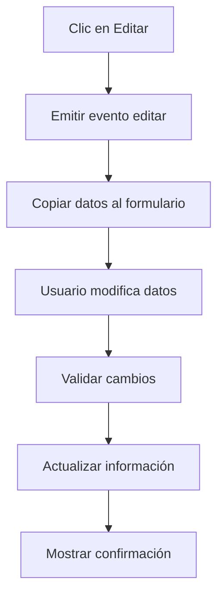
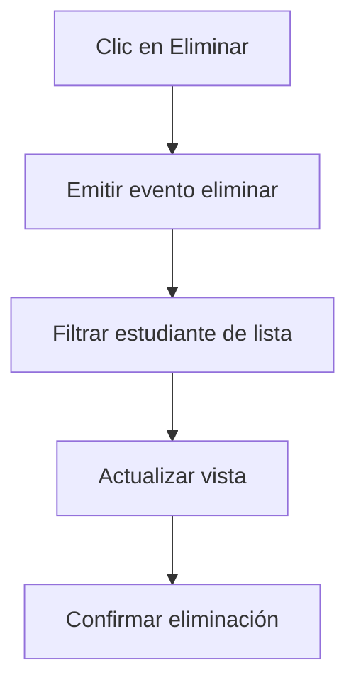

# INFORME TÉCNICO - PROYECTO FROMEROE01
## Sistema de Gestión de Estudiantes

---

### ÍNDICE
1. [Resumen Ejecutivo](#resumen-ejecutivo)
2. [Descripción del Proyecto](#descripción-del-proyecto)
3. [Arquitectura Técnica](#arquitectura-técnica)
4. [Componentes del Sistema](#componentes-del-sistema)
5. [Flujo de Funcionamiento](#flujo-de-funcionamiento)
6. [Estructura de Datos](#estructura-de-datos)
7. [Tecnologías Utilizadas](#tecnologías-utilizadas)
8. [Instalación y Configuración](#instalación-y-configuración)
9. [Funcionalidades Implementadas](#funcionalidades-implementadas)
10. [Análisis de Código](#análisis-de-código)
11. [Conclusiones](#conclusiones)

---

## 1. RESUMEN EJECUTIVO

**Proyecto:** FromeroE01 - Sistema de Gestión de Estudiantes  
**Versión:** 0.0.0  
**Framework:** Angular 20  
**Fecha de Análisis:** Diciembre 2024  
**Estado:** Funcionalmente Completo  

### Objetivo Principal
Desarrollar una aplicación web moderna para la gestión integral de información de estudiantes, permitiendo operaciones CRUD (Crear, Leer, Actualizar, Eliminar) con una interfaz de usuario intuitiva y responsiva.

### Alcance
- Gestión completa de registros de estudiantes
- Interfaz de usuario moderna con Angular Material
- Validación de datos en tiempo real
- Arquitectura modular y escalable

---

## 2. DESCRIPCIÓN DEL PROYECTO

### Propósito
El proyecto FromeroE01 es una aplicación web desarrollada en Angular que proporciona una solución completa para la administración de información de estudiantes. La aplicación permite a los usuarios gestionar de manera eficiente los datos académicos y personales de los estudiantes.

### Características Principales
- **Interfaz Intuitiva:** Diseño moderno con Angular Material y Bootstrap
- **Operaciones CRUD:** Crear, leer, actualizar y eliminar registros de estudiantes
- **Validación Robusta:** Verificación de datos en tiempo real
- **Arquitectura Modular:** Componentes reutilizables y mantenibles
- **Responsive Design:** Compatible con diferentes dispositivos

### Público Objetivo
- Administradores educativos
- Personal docente
- Desarrolladores que buscan ejemplos de implementación Angular

---

## 3. ARQUITECTURA TÉCNICA

### Arquitectura General
El proyecto sigue la arquitectura de componentes de Angular, implementando el patrón de diseño modular con separación clara de responsabilidades.

```
┌─────────────────────────────────────────────────────────────┐
│                    APLICACIÓN ANGULAR                       │
├─────────────────────────────────────────────────────────────┤
│  ┌─────────────┐  ┌─────────────┐  ┌─────────────┐         │
│  │   TOOLBAR   │  │   NAVBAR    │  │   CONTENT   │         │
│  └─────────────┘  └─────────────┘  └─────────────┘         │
├─────────────────────────────────────────────────────────────┤
│  ┌─────────────────────────────────────────────────────────┐ │
│  │              STUDENTS TABLE                             │ │
│  │  ┌─────────┐ ┌─────────┐ ┌─────────┐ ┌─────────┐       │ │
│  │  │ Nombre  │ │  Edad   │ │   DNI   │ │Promedio│       │ │
│  │  └─────────┘ └─────────┘ └─────────┘ └─────────┘       │ │
│  └─────────────────────────────────────────────────────────┘ │
├─────────────────────────────────────────────────────────────┤
│  ┌─────────────────────────────────────────────────────────┐ │
│  │              ADD/EDIT FORM                              │ │
│  │  ┌─────────┐ ┌─────────┐ ┌─────────┐ ┌─────────┐       │ │
│  │  │  DNI    │ │ Nombre  │ │Apellido │ │  Edad   │       │ │
│  │  └─────────┘ └─────────┘ └─────────┘ └─────────┘       │ │
│  └─────────────────────────────────────────────────────────┘ │
└─────────────────────────────────────────────────────────────┘
```

### Patrones de Diseño Implementados
1. **Component Pattern:** Separación de responsabilidades
2. **Observer Pattern:** Comunicación entre componentes
3. **Dependency Injection:** Inyección de servicios
4. **Reactive Forms:** Gestión de formularios

---

## 4. COMPONENTES DEL SISTEMA

### 4.1 Componente Principal (App)
**Archivo:** `src/app/app.ts`

**Responsabilidades:**
- Coordinación general de la aplicación
- Gestión del estado de estudiantes
- Comunicación entre componentes
- Carga inicial de datos

**Características Técnicas:**
```typescript
export class App implements OnInit {
  students: Student[] = [];
  
  // Métodos principales:
  - ngOnInit(): Carga datos iniciales
  - addStudent(): Agrega nuevo estudiante
  - eliminarEstudiante(): Elimina estudiante
  - editarEstudiante(): Prepara edición
}
```

### 4.2 Tabla de Estudiantes (StudentsTable)
**Archivo:** `src/app/students-table/students-table.ts`

**Responsabilidades:**
- Visualización de datos en formato tabla
- Gestión de acciones de edición y eliminación
- Integración con Angular Material Table

**Columnas Mostradas:**
- Nombre completo (usando FullnamePipe)
- Edad
- DNI
- Promedio académico
- Acciones (Editar/Eliminar)

### 4.3 Formulario de Gestión (AddForm)
**Archivo:** `src/app/add-form/add-form.ts`

**Responsabilidades:**
- Captura de datos de estudiantes
- Validación de formularios
- Gestión de estados de edición
- Notificaciones de usuario

**Validaciones Implementadas:**
- DNI: Campo obligatorio
- Nombre: Campo obligatorio
- Apellido: Campo obligatorio
- Edad: Obligatorio, mínimo 0
- Promedio: Obligatorio, rango 0-10

### 4.4 Componentes de Navegación
- **Toolbar:** Barra de herramientas superior
- **Navbar:** Barra de navegación

---

## 5. FLUJO DE FUNCIONAMIENTO

### 5.1 Inicialización de la Aplicación
```mermaid
graph TD
    A[Inicio de Aplicación] --> B[Cargar Componente App]
    B --> C[Inicializar HttpClient]
    C --> D[Realizar GET a mocks/students.json]
    D --> E[Cargar datos en students[]]
    E --> F[Renderizar StudentsTable]
    F --> G[Aplicación Lista]
```

### 5.2 Proceso de Agregar Estudiante
```mermaid
graph TD
    A[Usuario llena formulario] --> B[Validar campos]
    B --> C{Campos válidos?}
    C -->|Sí| D[Emitir studentAdded]
    C -->|No| E[Mostrar errores]
    D --> F[Agregar a students[]]
    F --> G[Mostrar notificación]
    G --> H[Limpiar formulario]
    E --> A
```

### 5.3 Proceso de Editar Estudiante


### 5.4 Proceso de Eliminar Estudiante


---

## 6. ESTRUCTURA DE DATOS

### 6.1 Interfaz Student
```typescript
export interface Student {
  name: string;      // Nombre del estudiante
  surname: string;   // Apellido del estudiante
  age: number;       // Edad en años
  dni: number;       // Documento Nacional de Identidad
  average: number;   // Promedio académico (0-10)
}
```

### 6.2 Datos de Ejemplo
```json
[
  {
    "name": "Juan",
    "surname": "Pérez",
    "age": 20,
    "dni": 12345678,
    "average": 8.5
  },
  {
    "name": "María",
    "surname": "Gómez",
    "age": 22,
    "dni": 87654321,
    "average": 9.0
  },
  {
    "name": "Pedro",
    "surname": "López",
    "age": 21,
    "dni": 11223344,
    "average": 7.5
  }
]
```

### 6.3 Pipes Personalizados
**FullnamePipe:** Combina nombre y apellido
```typescript
transform(name: string, surname: string): string {
  return `${name} ${surname}`;
}
```

---

## 7. TECNOLOGÍAS UTILIZADAS

### 7.1 Framework Principal
- **Angular 20.0.0:** Framework de desarrollo frontend
- **TypeScript 5.8.2:** Lenguaje de programación tipado

### 7.2 Librerías de UI
- **Angular Material 20.1.1:** Componentes de interfaz
- **Bootstrap 5.3.6:** Framework CSS
- **Bootstrap Icons 1.13.1:** Iconografía
- **ng-bootstrap 19.0.1:** Componentes Bootstrap para Angular

### 7.3 Herramientas de Desarrollo
- **Angular CLI 20.0.3:** Herramientas de línea de comandos
- **Karma 6.4.0:** Test runner
- **Jasmine 5.7.0:** Framework de testing

### 7.4 Dependencias Principales
- **RxJS 7.8.0:** Programación reactiva
- **Zone.js 0.15.0:** Detección de cambios
- **Popper.js 2.11.8:** Posicionamiento de elementos

---

## 8. INSTALACIÓN Y CONFIGURACIÓN

### 8.1 Requisitos Previos
- Node.js (versión 18 o superior)
- npm (incluido con Node.js)
- Angular CLI (instalado globalmente)

### 8.2 Pasos de Instalación
```bash
# 1. Clonar el repositorio
git clone [URL_DEL_REPOSITORIO]
cd Fromero-E01

# 2. Instalar dependencias
npm install

# 3. Iniciar servidor de desarrollo
npm start

# 4. Abrir navegador
# Navegar a: http://localhost:4200
```

### 8.3 Scripts Disponibles
```json
{
  "start": "ng serve",           // Servidor de desarrollo
  "build": "ng build",           // Construcción para producción
  "watch": "ng build --watch",   // Construcción con watch
  "test": "ng test"              // Ejecutar tests
}
```

---

## 9. FUNCIONALIDADES IMPLEMENTADAS

### 9.1 Gestión de Estudiantes
✅ **Crear:** Formulario completo con validaciones  
✅ **Leer:** Tabla con visualización de todos los datos  
✅ **Actualizar:** Edición inline con formulario reutilizable  
✅ **Eliminar:** Eliminación con confirmación  

### 9.2 Validaciones de Datos
✅ **Campos Obligatorios:** DNI, nombre, apellido  
✅ **Rangos Numéricos:** Edad ≥ 0, promedio 0-10  
✅ **Feedback Visual:** Mensajes de error y éxito  
✅ **Prevención de Errores:** Validación en tiempo real  

### 9.3 Experiencia de Usuario
✅ **Interfaz Responsiva:** Compatible con móviles  
✅ **Notificaciones:** Feedback inmediato al usuario  
✅ **Navegación Intuitiva:** Flujo de trabajo claro  
✅ **Diseño Moderno:** Material Design y Bootstrap  

### 9.4 Características Técnicas
✅ **Arquitectura Modular:** Componentes reutilizables  
✅ **Comunicación Entre Componentes:** Eventos y inputs/outputs  
✅ **Gestión de Estado:** Estado centralizado en App  
✅ **Código Limpio:** Estructura clara y documentada  

---

## 10. ANÁLISIS DE CÓDIGO

### 10.1 Estructura de Archivos
```
Fromero-E01/
├── src/
│   ├── app/
│   │   ├── add-form/          # Formulario de gestión
│   │   ├── navbar/            # Barra de navegación
│   │   ├── students-table/    # Tabla de estudiantes
│   │   ├── toolbar/           # Barra de herramientas
│   │   ├── app.ts             # Componente principal
│   │   ├── app.html           # Template principal
│   │   └── app.routes.ts      # Configuración de rutas
│   ├── shared/
│   │   ├── entities.ts        # Interfaces de datos
│   │   └── pipes/             # Pipes personalizados
│   └── main.ts                # Punto de entrada
├── public/
│   └── mocks/
│       └── students.json      # Datos de ejemplo
└── package.json               # Dependencias y scripts
```

### 10.2 Patrones de Comunicación
- **Input/Output:** Comunicación padre-hijo
- **EventEmitter:** Eventos personalizados
- **HttpClient:** Comunicación con datos externos
- **Reactive Forms:** Gestión de formularios

### 10.3 Buenas Prácticas Implementadas
- Separación de responsabilidades
- Componentes reutilizables
- Validación robusta
- Manejo de errores
- Código tipado con TypeScript

---

## 11. CONCLUSIONES

### 11.1 Logros del Proyecto
El proyecto FromeroE01 demuestra una implementación exitosa de una aplicación Angular moderna con las siguientes fortalezas:

1. **Arquitectura Sólida:** Estructura modular y mantenible
2. **Funcionalidad Completa:** Todas las operaciones CRUD implementadas
3. **Experiencia de Usuario:** Interfaz intuitiva y responsiva
4. **Código de Calidad:** Implementación de buenas prácticas
5. **Escalabilidad:** Fácil extensión para nuevas funcionalidades

### 11.2 Aspectos Destacados
- **Modernidad:** Uso de Angular 20 con las últimas características
- **Robustez:** Validaciones completas y manejo de errores
- **Mantenibilidad:** Código bien estructurado y documentado
- **Usabilidad:** Interfaz clara y fácil de usar

### 11.3 Oportunidades de Mejora
- Implementación de persistencia de datos (base de datos)
- Autenticación y autorización de usuarios
- Reportes y estadísticas
- Filtros y búsqueda avanzada
- Tests unitarios y de integración

### 11.4 Valor Técnico
Este proyecto sirve como excelente ejemplo de:
- Desarrollo moderno con Angular
- Implementación de patrones de diseño
- Gestión de formularios reactivos
- Comunicación entre componentes
- Integración con librerías de UI

---

## APÉNDICES

### A. Comandos Útiles
```bash
# Generar nuevo componente
ng generate component nombre-componente

# Generar nuevo servicio
ng generate service nombre-servicio

# Ejecutar tests
ng test

# Construir para producción
ng build --configuration production
```

### B. Recursos Adicionales
- [Documentación Angular](https://angular.dev/)
- [Angular Material](https://material.angular.io/)
- [Bootstrap](https://getbootstrap.com/)
- [TypeScript](https://www.typescriptlang.org/)

---

**Documento generado:** Diciembre 2024  
**Versión del proyecto:** 0.0.0  
**Framework:** Angular 20  
**Autor del análisis:** Asistente IA 